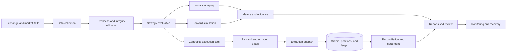

# Algorithmic Trading and Market Automation

> Personal engineering and research case study. This is not financial advice, a performance claim, or an offer of a trading system. Strategy rules, credentials, account data, and production configuration remain private.

## Overview

This project family explores the engineering required to build reliable automated systems for cryptocurrency and prediction markets. The work includes market-data ingestion, strategy research, simulation, controlled execution workflows, reconciliation, monitoring, and recovery.

Integrations have included Binance and Polymarket APIs. The emphasis is not only on generating a signal: it is on proving that data, decisions, orders, positions, and accounting remain consistent throughout the full lifecycle.

## The problem

An automated market system must handle more than a trading idea. It also needs to manage:

- Incomplete, stale, duplicated, or malformed market data
- Fees, slippage, liquidity, and partial execution
- Position sizing and portfolio exposure
- Restarts and repeated-event protection
- Order, account, and local-ledger reconciliation
- Clear separation between research, simulation, and authorized execution
- Monitoring that distinguishes normal filtering from an actual failure

## Architecture

## Engineering highlights

### Evidence-based strategy evaluation

Research workflows model fees, slippage, position sizing, drawdown, and chronological validation. Rejected experiments are preserved alongside successful tests to reduce hindsight bias and repeated work.

### Explicit environment boundaries

Historical replay, forward simulation, and execution-capable workflows are treated as separate operating modes. Simulated results are never presented as real account value or production readiness.

### Fail-closed controls

The system blocks new actions when critical data, authorization, account state, or reconciliation evidence is missing or ambiguous. Health checks and risk gates are kept separate: a running service is not automatically safe to trade.

### Stateful and restart-safe operation

SQLite-backed state, deterministic identifiers, and lifecycle checks prevent accidental duplication after retries or restarts. Orders, positions, reservations, and settlements are reconciled instead of inferred from a single response.

### Operational monitoring

Reports distinguish ordinary candidate rejection—such as insufficient modeled edge or liquidity—from global blockers and runtime failures. This makes a quiet trading cycle diagnosable without weakening safety controls.

## My contribution

- Designed and implemented Python workflows for market data, strategy evaluation, and automation.
- Integrated REST and streaming market APIs.
- Built historical replay and forward-simulation tools.
- Added cost, liquidity, sizing, exposure, and drawdown modeling.
- Implemented account and ledger reconciliation, health checks, and recovery logic.
- Developed containerized and scheduled operational workflows.
- Used AI-assisted development for rapid prototyping while retaining deterministic tests and manual verification.

## Technologies

`Python` · `REST APIs` · `WebSockets` · `SQLite` · `Docker Compose` · `Linux` · `Bash` · `PowerShell` · `Automated Testing` · `Market Data`

## What I learned

- A promising backtest is only a research result, not deployment evidence.
- Reliability and accounting are part of the strategy lifecycle, not secondary infrastructure.
- Win rate alone does not establish positive expectancy.
- Monitoring must explain both why the system acted and why it correctly did nothing.
- Safe automation requires explicit authorization, bounded risk, and recoverable state transitions.

## Public scope

The underlying implementations remain private. This repository intentionally excludes executable strategy rules, API credentials, account information, infrastructure access details, financial results, and production configuration.

Back to [Russell Bukowski's GitHub profile](https://github.com/russellbukowski).
